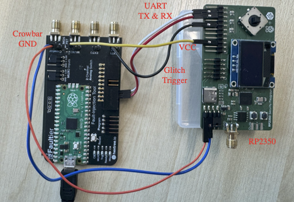

# BarkBeetle

This repository contains the source code for the paper **[BarkBeetle: Stealing Decision Tree Models with Fault Injection](https://dl.acm.org/doi/10.1145/3779208.3785372)**, accepted for publication in *Proceedings of the ACM Asia Conference on Computer and Communications Security (ASIA CCS 2026)*.

## Proof-of-Concept Attack for BarkBeetle

We convert the BigML-generated trees into the Emlearn-compatible format and store them in `tree.c` under the `BarkBeetle_simulation` directory.
```
tree1 -> medical provider charge model
tree2 -> iris model
tree3 -> diabetes diagnosis model
tree4 -> bitcoin model
tree5 -> appliances energy prediction model
```
Run BarkBeetle
```
make
./inf
```

## Voltage Glitch-Based Fault Injection on BarkBeetle

In `BarkBeetle_glitch`, we implement voltage glitch on BarkBeetle using [Faultier](https://github.com/hextreeio/faultier-python).
The hardware setup is shown in the figure below. The target board is an RP2350-based Security Playground board.




Detailed setup instructions and Faultier installation can be found in the [hextree.io course](https://app.hextree.io/map/hardware-hacking/fault-injection-introduction).

Compile the program
```
mkdir build && cd build
cmake -DPICO_PLATFORM=rp2350 -DPICO_BOARD=pico2 ..
make -j8
cp BarkBeetle.uf2 /media/adminlocal/RP2350 // the path for target RP2350 device
```
After flashing the firmware, connect the Faultier board to your machine and use the Jupyter notebook to begin glitching the RP2350 target.
The code for this part is available in `faultier_BarkBeetle.ipynb`.

## Citations
If you use `BarkBeetle` in an academic work, please reference it using:
```
@inproceedings{barkbeetle2026,
  title={BarkBeetle: Stealing Decision Tree Models with Fault Injection},
  author={Wang, Qifan and Sander, Jonas and Jiang, Minmin and Eisenbarth, Thomas and Oswald, David},
  booktitle={Proceedings of the ACM Asia Conference on Computer and Communications Security},
  series={ASIA CCS '26},
  pages={343--357},
  year={2026},
  publisher={Association for Computing Machinery},
  doi={10.1145/3779208.3785372}
}
```


## Disclaimer

This open source project is for proof of concept purposes only and should not be used in production environments. 
